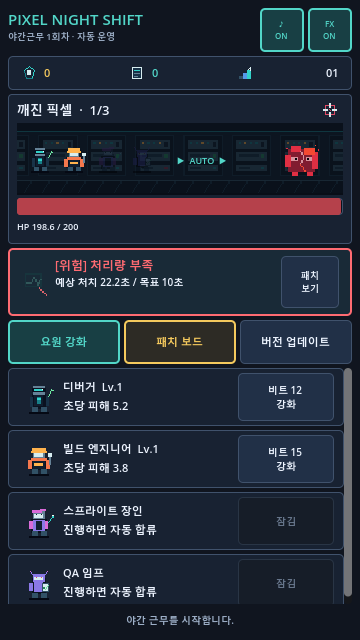

# Pixel Night Shift · 픽셀 야간근무

> 서버가 살아있다

《픽셀 야간근무》는 서비스 종료 직전의 레트로 게임을 지키는 야간 운영팀을 다룬 세로형 방치 게임입니다. 전투와 재도전은 완전 자동이며, 플레이어는 화면의 진단 정보를 읽고 요원을 강화하거나 장단점이 함께 있는 임시 패치를 선택합니다.

현재 실행 가능한 빌드는 **Godot 4.7용 20스테이지 혼합 전투 수직 슬라이스**입니다. `관찰 → 진단 → 패치 → 버전 업데이트` 순환과 앱 셸·로컬 저장·복구·오프라인 진행을 유지하면서, 보스전에서만 요원 역할·내구도·PROCESS DOWN·QA 자동 구조와 증거 기반 진단을 사용합니다. [본편 혼합 전투 완성도 명세](docs/COMBAT_HYBRID_SPEC.md)의 구현·자동 검증 순서 1~7과 [360×640 내부 한 회차 확인](docs/INTERNAL_PLAYTEST_2026-07-22.md)은 완료됐으며, 다음 완료 관문은 5인 플레이테스트입니다.



## 실행

Godot 4.7 Project Manager에서 `project.godot`을 가져온 뒤 프로젝트를 실행합니다. 메인 장면은 `res://game/app/app_root.tscn`이며 논리 해상도는 360×640입니다. 정상 콜드 부트는 타이틀에서 시작하며, 새 근무는 5단계 프롤로그 뒤 최초 저장에 성공한 다음 현장 온보딩으로 이어집니다.

Windows의 Godot 4.7 공식 빌드에는 GUI 종료 시 네이티브 오류 창이 나타날 수 있는 엔진 문제가 있습니다. 자동 검증에는 GUI 실행 파일이나 `godot.bat`을 직접 사용하지 말고 아래 전용 실행기를 사용합니다.

실제 화면과 소리를 확인하는 수동 E2E는 별도 세션 ID로 실행합니다. 새로운 ID는 빈 근무 기록으로 시작하고, 같은 ID를 다시 사용하면 방금 만든 테스트 기록을 이어갑니다. 실제 `user://`와 설정은 `.godot/manual-e2e-runtime/` 아래로 격리되며 종료 오류 대화상자도 억제됩니다.

```powershell
.\tools\run_godot_manual_e2e.ps1 -SessionId opening-check-001
```

## 검증

도메인 테스트는 별도 애드온 없이 Godot 자체의 스크립트 실행 기능으로 동작합니다. 헤드리스 전용 실행기는 Godot 프로세스를 하나씩 실행하고 로그와 `user://`를 프로젝트의 `.godot/` 아래에 격리합니다.

```powershell
.\tools\run_godot_headless.ps1 --script res://tools/validate_pixel_assets.gd
.\tools\run_godot_headless.ps1 --script res://tools/validate_audio.gd
.\tools\run_godot_headless.ps1 --script res://tests/test_runner.gd
.\tools\run_godot_headless.ps1 --script res://tests/app_shell/app_shell_test.gd
.\tools\run_godot_headless.ps1 --script res://tests/app_shell/app_root_integration_test.gd
.\tools\run_godot_headless.ps1 --script res://tests/balance_report.gd
.\tools\run_godot_headless.ps1 --script res://tests/hybrid_boss_test_runner.gd
.\tools\run_godot_headless.ps1 --script res://tests/combat_v2/combat_v2_comparison_report.gd -- --hybrid-only
.\tools\run_godot_headless.ps1 --quit-after 3
```

검증 명령은 파일을 바꾸지 않습니다. `tools/generate_pixel_assets.gd`와 `tools/generate_audio.gd`는 원본 에셋을 다시 쓰므로 재생성이 목적일 때만 별도로 실행합니다. 마지막 명령은 메인 장면이 헤드리스 환경에서 파서·리소스 오류 없이 시작되는지 확인합니다.

## 현재 포함 범위

- 360×640 세로형 메인 화면
- 자동 전투와 20스테이지
- 고정 요원 4명
- 후보 패치 5개와 패치 슬롯 3개
- 스테이지 10·20에서 강화 재사용되는 Watchdog Process 보스
- 비트, 패치노트, 버전 업데이트 1회 순환
- 보스 실패 후 자동 유지보수 파밍과 재도전
- 보스전 전용 요원 역할·HP·PROCESS DOWN과 QA 자동 구조
- 실패 근거가 포함된 진단 카드와 최대 2개의 사실 기반 요원 어필
- 요원·적·패치·자원용 원본 픽셀 에셋과 서버실 전투 배경
- 타이틀·전투·보스·유지보수 BGM 4곡, 프로젝트 원본 전투 효과음 4종과 상황별 효과음
- 진단에서 패치 화면으로 이어지는 UI와 음악·효과음 토글
- 콜드 부트 타이틀, 5단계 첫 근무 프롤로그, 야간 운영실, 설정, 현장 온보딩과 버전 업데이트 확인·요약 흐름
- schema 2 로컬 저장, schema 1 마이그레이션, 백업 복구와 결정론적 오프라인 진행
- Android 일시정지·복귀·뒤로가기·안전 영역 동작의 코드 및 통합 테스트
- 결정론적 도메인 테스트와 콘텐츠 검증

기본 본편에는 혼합 전투가 적용됐지만, 이전 Combat V2 테스트 모드와 중복 구현은 5인 플레이테스트 통과 전까지 비교 기준으로 남아 있습니다. Android 패키징은 현재 보류 중이며, 부서·사건·장편 콘텐츠·스테이지 21 이상과 대규모 표현 확장은 현재 범위 밖입니다. 상세한 제품 규칙은 [게임 설계 문서](docs/GDD.md), 현재 전투 기준은 [본편 혼합 전투 완성도 명세](docs/COMBAT_HYBRID_SPEC.md), 사람 검증은 [플레이테스트](docs/PLAYTEST.md), 콜드 부트와 첫 근무 진입은 [오프닝 경험 명세](docs/OPENING_EXPERIENCE_SPEC.md), 나머지 앱 흐름은 [앱 셸 명세](docs/APP_SHELL_SPEC.md), 코드 의존 계약은 [아키텍처](docs/ARCHITECTURE.md)를 참고하세요.

## 구조

```text
game/content/       수치와 콘텐츠 원본 및 로딩 검증
game/domain/        전투·성장·진단·환생 규칙
game/app/           GameSession 명령 경계
game/presentation/  장면과 UI
game/assets/        생성된 픽셀 PNG·WAV와 출처 매니페스트
tools/              에셋·오디오 재생성 및 검증 스크립트
tests/              헤드리스 관찰 행동 테스트
docs/               설계·범위·아키텍처 계약
```

표현 계층은 도메인 상태를 직접 바꾸지 않습니다. 모든 입력은 `GameSession` 명령으로 전달되고, 화면과 테스트는 스냅숏을 읽습니다.
